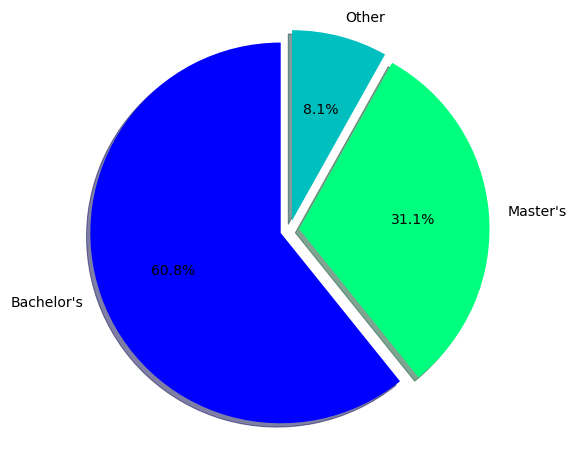

```python
import pandas as pd
import numpy as np
import matplotlib.pyplot as plt
import seaborn as sns
from wordcloud import WordCloud ,STOPWORDS, ImageColorGenerator
pd.set_option('display.max_columns', None)

df = pd.read_csv("/Users/anthonypatone/Desktop/Projects/NYC Job Data/nyc-jobs.csv", delimiter=',')
```


```python
nRow, nCol = df.shape
print(f'There are {nRow} rows and {nCol} columns')
```

    There are 3116 rows and 28 columns


```python
df.head()
```


<div>
<style scoped>
    .dataframe tbody tr th:only-of-type {
        vertical-align: middle;
    }

    .dataframe tbody tr th {
        vertical-align: top;
    }

    .dataframe thead th {
        text-align: right;
    }
</style>
<table border="1" class="dataframe">
  <thead>
    <tr style="text-align: right;">
      <th></th>
      <th>Job ID</th>
      <th>Agency</th>
      <th>Posting Type</th>
      <th># Of Positions</th>
      <th>Business Title</th>
      <th>Civil Service Title</th>
      <th>Title Code No</th>
      <th>Level</th>
      <th>Job Category</th>
      <th>Full-Time/Part-Time indicator</th>
      <th>Salary Range From</th>
      <th>Salary Range To</th>
      <th>Salary Frequency</th>
      <th>Work Location</th>
      <th>Division/Work Unit</th>
      <th>Job Description</th>
      <th>Minimum Qual Requirements</th>
      <th>Preferred Skills</th>
      <th>Additional Information</th>
      <th>To Apply</th>
      <th>Hours/Shift</th>
      <th>Work Location 1</th>
      <th>Recruitment Contact</th>
      <th>Residency Requirement</th>
      <th>Posting Date</th>
      <th>Post Until</th>
      <th>Posting Updated</th>
      <th>Process Date</th>
    </tr>
  </thead>
  <tbody>
    <tr>
      <th>0</th>
      <td>87990</td>
      <td>DEPARTMENT OF BUSINESS SERV.</td>
      <td>Internal</td>
      <td>1</td>
      <td>Account Manager</td>
      <td>CONTRACT REVIEWER (OFFICE OF L</td>
      <td>40563</td>
      <td>1</td>
      <td>NaN</td>
      <td>NaN</td>
      <td>42405.00</td>
      <td>65485.00</td>
      <td>Annual</td>
      <td>110 William St. N Y</td>
      <td>Strategy &amp; Analytics</td>
      <td>Division of Economic &amp; Financial Opportunity (...</td>
      <td>1.\tA baccalaureate degree from an accredited ...</td>
      <td>•\tExcellent interpersonal and organizationa...</td>
      <td>Salary range for this position is: $42,405 - $...</td>
      <td>NaN</td>
      <td>NaN</td>
      <td>NaN</td>
      <td>NaN</td>
      <td>New York City residency is generally required ...</td>
      <td>2011-06-24T00:00:00.000</td>
      <td>NaN</td>
      <td>2011-06-24T00:00:00.000</td>
      <td>2019-07-09T00:00:00.000</td>
    </tr>
    <tr>
      <th>1</th>
      <td>97899</td>
      <td>DEPARTMENT OF BUSINESS SERV.</td>
      <td>Internal</td>
      <td>1</td>
      <td>EXECUTIVE DIRECTOR, BUSINESS DEVELOPMENT</td>
      <td>ADMINISTRATIVE BUSINESS PROMOT</td>
      <td>10009</td>
      <td>M3</td>
      <td>NaN</td>
      <td>F</td>
      <td>60740.00</td>
      <td>162014.00</td>
      <td>Annual</td>
      <td>110 William St. N Y</td>
      <td>Tech Talent Pipeline</td>
      <td>The New York City Department of Small Business...</td>
      <td>1. A baccalaureate degree from an accredited c...</td>
      <td>NaN</td>
      <td>NaN</td>
      <td>In addition to applying through this website, ...</td>
      <td>NaN</td>
      <td>NaN</td>
      <td>NaN</td>
      <td>New York City residency is generally required ...</td>
      <td>2012-01-26T00:00:00.000</td>
      <td>NaN</td>
      <td>2012-01-26T00:00:00.000</td>
      <td>2019-07-09T00:00:00.000</td>
    </tr>
    <tr>
      <th>2</th>
      <td>132292</td>
      <td>NYC HOUSING AUTHORITY</td>
      <td>External</td>
      <td>52</td>
      <td>Maintenance Worker - Technical Services-Heatin...</td>
      <td>MAINTENANCE WORKER</td>
      <td>90698</td>
      <td>0</td>
      <td>Maintenance &amp; Operations</td>
      <td>F</td>
      <td>51907.68</td>
      <td>54580.32</td>
      <td>Annual</td>
      <td>Heating Mgt-Operations</td>
      <td>Management Services Department</td>
      <td>Under direct supervision, assist in the routin...</td>
      <td>1. Three years of full-time satisfactory exper...</td>
      <td>1.  A High School Diploma or GED.  2.  CDL Dri...</td>
      <td>1.  A Motor Vehicle Driver’s License valid i...</td>
      <td>Click the "Apply Now" button.</td>
      <td>NaN</td>
      <td>NaN</td>
      <td>NaN</td>
      <td>NYCHA has no residency requirements.</td>
      <td>2013-10-24T00:00:00.000</td>
      <td>NaN</td>
      <td>2013-12-12T00:00:00.000</td>
      <td>2019-07-09T00:00:00.000</td>
    </tr>
    <tr>
      <th>3</th>
      <td>132292</td>
      <td>NYC HOUSING AUTHORITY</td>
      <td>Internal</td>
      <td>52</td>
      <td>Maintenance Worker - Technical Services-Heatin...</td>
      <td>MAINTENANCE WORKER</td>
      <td>90698</td>
      <td>0</td>
      <td>Maintenance &amp; Operations</td>
      <td>F</td>
      <td>51907.68</td>
      <td>54580.32</td>
      <td>Annual</td>
      <td>Heating Mgt-Operations</td>
      <td>Management Services Department</td>
      <td>Under direct supervision, assist in the routin...</td>
      <td>1. Three years of full-time satisfactory exper...</td>
      <td>1.  A High School Diploma or GED.  2.  CDL Dri...</td>
      <td>1.  A Motor Vehicle Driver’s License valid i...</td>
      <td>Click the "Apply Now" button.</td>
      <td>NaN</td>
      <td>NaN</td>
      <td>NaN</td>
      <td>NYCHA has no residency requirements.</td>
      <td>2013-10-24T00:00:00.000</td>
      <td>NaN</td>
      <td>2013-12-12T00:00:00.000</td>
      <td>2019-07-09T00:00:00.000</td>
    </tr>
    <tr>
      <th>4</th>
      <td>133921</td>
      <td>NYC HOUSING AUTHORITY</td>
      <td>Internal</td>
      <td>50</td>
      <td>Temporary Painter</td>
      <td>PAINTER</td>
      <td>91830</td>
      <td>0</td>
      <td>Maintenance &amp; Operations</td>
      <td>F</td>
      <td>35.00</td>
      <td>35.00</td>
      <td>Hourly</td>
      <td>DMP-Contract &amp; Analysis Unit</td>
      <td>Dept of Management &amp; Planning</td>
      <td>Responsibilities of selected candidates will i...</td>
      <td>1. Five years of full-time satisfactory experi...</td>
      <td>NaN</td>
      <td>SPECIAL NOTE:    1.  This is a temporary assig...</td>
      <td>Click the "Apply Now" button.</td>
      <td>NaN</td>
      <td>NaN</td>
      <td>NaN</td>
      <td>NYCHA has no residency requirement.</td>
      <td>2014-01-09T00:00:00.000</td>
      <td>NaN</td>
      <td>2014-01-08T00:00:00.000</td>
      <td>2019-07-09T00:00:00.000</td>
    </tr>
  </tbody>
</table>
</div>


```python
#null count excluding columns with with complete data
nullseries = df.isnull().sum()
nullseries[nullseries > 0]
```


    Job Category                        2
    Full-Time/Part-Time indicator     261
    Minimum Qual Requirements          14
    Preferred Skills                  377
    Additional Information           1177
    To Apply                            1
    Hours/Shift                      2123
    Work Location 1                  1719
    Recruitment Contact              3116
    Post Until                       2214
    dtype: int64


```python
#count unique agencies and print in list
df['Agency'].nunique()
```


    54


```python
#list of unique agencies
df_agency = df['Agency'].unique()
agency_list = df_agency.tolist()
agency_list[:10]
```


    ['DEPARTMENT OF BUSINESS SERV.',
     'NYC HOUSING AUTHORITY',
     'DEPT OF HEALTH/MENTAL HYGIENE',
     'DEPT OF ENVIRONMENT PROTECTION',
     'LAW DEPARTMENT',
     'DEPT OF INFO TECH & TELECOMM',
     'NYC EMPLOYEES RETIREMENT SYS',
     'OFFICE OF COLLECTIVE BARGAININ',
     "ADMIN FOR CHILDREN'S SVCS",
     'DEPARTMENT OF TRANSPORTATION']


```python
#value_count of agencies
agencycount = df.groupby('Agency')['Job ID'].nunique().sort_values(ascending=False)
agencycount25 = agencycount[:25]

plt.figure(figsize=(10,10))
sns.countplot(y="Agency", data=df, order=agencycount25.index, palette='winter_r')
plt.title('Top 25 Agencies with the Most Job Postings')
```


    Text(0.5, 1.0, 'Top 25 Agencies with the Most Job Postings')


```python
#unique civil service title
servicetitle = df.groupby('Civil Service Title')['Job ID'].nunique().sort_values(ascending=False)
servicetitle25 = servicetitle[:25]

plt.figure(figsize=(10,10))
sns.countplot(y="Civil Service Title", data=df, order=servicetitle25.index, palette='winter_r')
plt.title('Top 25 Job Openings by Title')
```


    Text(0.5, 1.0, 'Top 25 Job Openings by Title')


```python
df['Civil Service Title'] = df["Civil Service Title"].str.replace("ANALYST", "").str.replace("MANAGER", "").str.replace("ASSOCIATE", "").str.replace("ADMINISTRATIVE", "")
```


```python
#unique civil service title

df1 = df.copy(deep=True)
df1['Civil Service Title'] = df1['Civil Service Title'].str.replace('ADMINISTRATIVE','')
titles = df1.groupby('Civil Service Title')['Job ID'].nunique().sort_values(ascending=False)
titles = titles[:50]

titlelist = ' '.join(titles.index.tolist())
wordcloud = WordCloud(background_color='white',
                 width=1024, height=720, colormap='winter').generate(titlelist)
plt.figure(figsize=(10,8))
plt.clf()
plt.imshow(wordcloud, interpolation="bilinear")
plt.axis('off')
plt.show()
```


```python
salfreq = df['Salary Frequency'].value_counts()
salfreq
```


    Annual    2876
    Hourly     212
    Daily       28
    Name: Salary Frequency, dtype: int64


```python
labels = df['Salary Frequency'].value_counts().index
values = df['Salary Frequency'].value_counts().values
```


```python
colors = ['blue', 'springgreen', 'c']
explode = (0.0, 0.0, 0.0)  # explode 1st slice
plt.figure(figsize=(7,7))
plt.rcParams['font.size'] = 14.0
plt.pie(values, explode=explode, colors=colors,labels=labels, autopct='%1.1f%%', shadow=True, startangle=90, pctdistance=1.08, labeldistance=1.16)

plt.axis('equal')
plt.show()
```


```python
#percentages of jobs that require bachelors degree
import re
df['requir'] = df['Minimum Qual Requirements'].str.contains(r'(baccalaureate)', flags=re.I)

df3 = df[['requir' , 'Minimum Qual Requirements']]
df3 = df3.reset_index(drop=True)
df3 = df3[df3['requir']== True]

bachpercentdegree = len(df3) / len(df)
answer = float(round(bachpercentdegree*100, 2))
print('{}% of jobs require a bachelor\'s degree'.format(answer))
```

    60.78% of jobs require a bachelor's degree


    /Users/anthonypatone/anaconda3/lib/python3.7/site-packages/ipykernel_launcher.py:3: UserWarning: This pattern has match groups. To actually get the groups, use str.extract.
      This is separate from the ipykernel package so we can avoid doing imports until


```python
df['requir1'] = df['Minimum Qual Requirements'].str.contains(r'(master[\']?[Ss]?)', flags=re.I)
df4 = df[['requir1' , 'Minimum Qual Requirements']]
df4 = df4.reset_index(drop=True)
df4 = df4[df4['requir1']== True]

masterpercent = len(df4) / len(df)
answer1 = float(round(masterpercent*100, 2))
print('{}% of jobs require a master\'s degree'.format(answer1))
```

    31.1% of jobs require a master's degree


    /Users/anthonypatone/anaconda3/lib/python3.7/site-packages/ipykernel_launcher.py:1: UserWarning: This pattern has match groups. To actually get the groups, use str.extract.
      """Entry point for launching an IPython kernel.


```python
Bachelors = answer
Masters = answer1
Other = 100 - answer - answer1
piedata = [Bachelors, Masters, Other]
labels1 = ['Bachelor\'s','Master\'s','Other']
colors = ['blue', 'springgreen', 'c']
explode = (0.05, 0.05, 0.05)  # explode 1st slice
plt.figure(figsize=(10,8))
plt.rcParams['font.size'] = 14.0
plt.pie(piedata, explode=explode, labels=labels1, colors=colors,
autopct='%1.1f%%', shadow=True, startangle=90)

plt.axis('equal')
plt.show()
```





```python
salcount = df['Salary Range To'].value_counts(bins=20).sort_index(ascending=False)
salcount
```


    (222682.418, 234402.0]               20
    (210962.836, 222682.418]             18
    (199243.254, 210962.836]             13
    (187523.672, 199243.254]             18
    (175804.09, 187523.672]              54
    (164084.508, 175804.09]              72
    (152364.926, 164084.508]             64
    (140645.344, 152364.926]            101
    (128925.762, 140645.344]             85
    (117206.18, 128925.762]             141
    (105486.598, 117206.18]             201
    (93767.016, 105486.598]             354
    (82047.434, 93767.016]              354
    (70327.852, 82047.434]              455
    (58608.27, 70327.852]               510
    (46888.688, 58608.27]               295
    (35169.106, 46888.688]              114
    (23449.524, 35169.106]                7
    (11729.942, 23449.524]                0
    (-224.03300000000002, 11729.942]    240
    Name: Salary Range To, dtype: int64


```python
df3 = df.copy(deep=True)
df3['average_salary'] = (df3['Salary Range From'] + df3['Salary Range To'])/2
df3 = df3[df3['Salary Frequency'] == 'Annual']

plt.figure(figsize=(10,10))
plt.hist(df3['average_salary'], bins=20, color = "b")
_, max_ = plt.ylim()
plt.axvline(df3['average_salary'].mean(), color='k', linestyle='dashed', linewidth=1)
plt.text(df3['average_salary'].mean() + df3['average_salary'].mean()/10, max_ - max_/10, 'Mean: {:.2f}'.format(df3['average_salary'].mean()))
plt.title('NYC Government Salary Distribution')
plt.show()
```


```python

```
